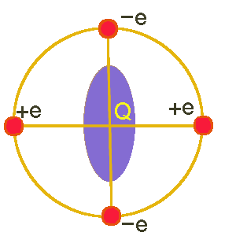

This is the code I wrote in Python3 that allows the user to calculate the electric field gradient (or EFG) from a point charge distribution in a crystal,
in the desired position.

The main file is [EFG_point_charge](https://github.com/JonathanFrassineti/Point-Charge-Electric-Field-Gradient/blob/master/EFG_point_charge.py), while [EFG_functions](https://github.com/JonathanFrassineti/Point-Charge-Electric-Field-Gradient/blob/master/EFG_functions.py) contains all the functions used to calculate the EFG and [Crystalline_structure](https://github.com/JonathanFrassineti/Point-Charge-Electric-Field-Gradient/blob/master/Crystalline_structure.py) the definition of the atomic bases of the material. 
The user has to interact with files [Crystalline_structure](https://github.com/JonathanFrassineti/Point-Charge-Electric-Field-Gradient/blob/master/Crystalline_structure.py) and [EFG_point_charge](https://github.com/JonathanFrassineti/Point-Charge-Electric-Field-Gradient/blob/master/EFG_point_charge.py). 
The possibility to add a pertubing particle inside the crystal (such as the muon) is still in beta version (to be improved, now olny valid for A15 compounds).

For physical details about what is the EFG, and what is the point charge approximation, please visit:
https://en.wikipedia.org/wiki/Electric_field_gradient, https://en.wikipedia.org/wiki/Electric_potential

For a much deeper explanation, please have a look at [README](https://github.com/JonathanFrassineti/Point-Charge-Electric-Field-Gradient/blob/main/README.pdf).

